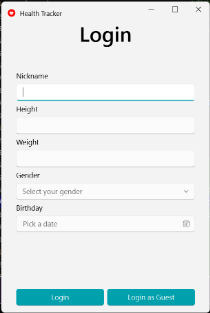
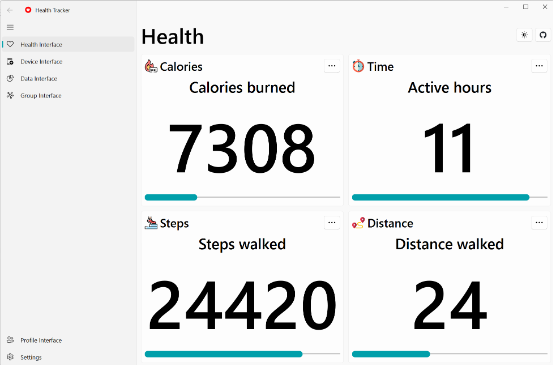
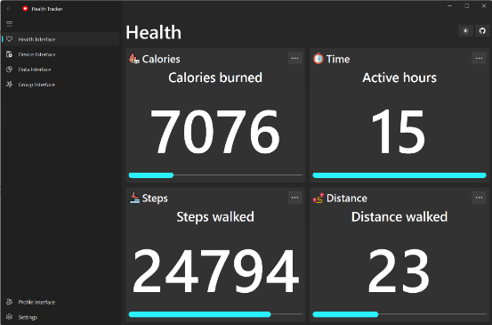
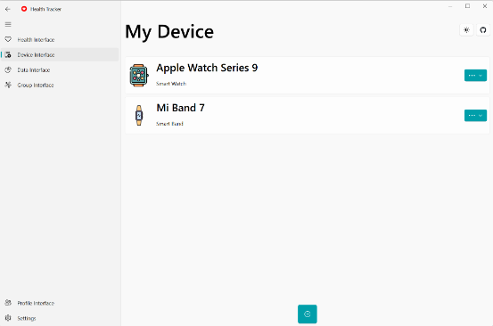
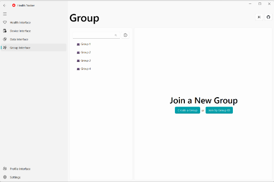
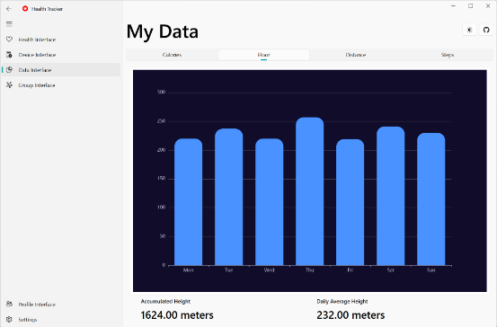
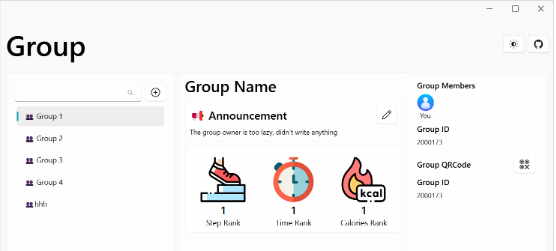
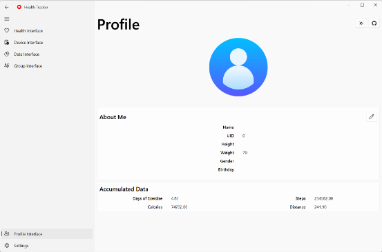

# Health Tracker

## Introduction

This is a health tracker application for Windows 10/11. It can track your steps, heart rate, sleep, and so on. It also provides a GUI for you to view your data.

## Features

- Track your steps, heart rate, sleep, and so on.
- Provide a GUI for you to view your data.
- Stimulate user data for testing.
- Support multiple users.
- Support multiple data sources.
- Support multiple GUI frameworks.

## Requirements

- python 3.8
- x64 windows 10/11

```bash
pip install -r requirements.txt
```

## Quick Start

To simply run the program, execute `python main.py run -f pyQt`.

The followings are more commands for specific use.

```bash
# help
python main.py -h
# run app
python main.py run -h              # print help
python main.py run -f pyQt         # run with pyQt, default user 0
python main.py run -f pyQt -u 1    # run with pyQt, specify user 1

# stimulate user data
python main.py stimulator -h      # print help
python main.py stimulator -d a 0  # generate all data for user 0
python main.py stimulator -d s 0  # generate steps data for user 0
python main.py stimulator -d a    # generate all data for user 0 (default 0)
```

## Screenshots
















